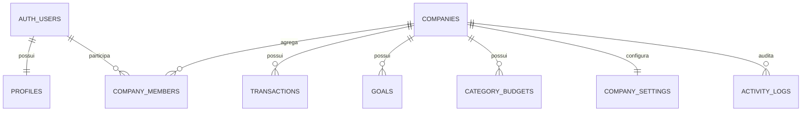

# Banco de dados

`auth.users` autentica pessoas; `profiles` guarda identidade e papel global; `companies` representa tenants; `company_members` liga pessoas a empresas. Dados financeiros usam UUID `company_id`, nunca e-mail ou nome.

Papéis globais: `user`, `admin`, `super_admin`; vínculos: `company_owner`, `member`. `is_vertex_admin` e `is_company_member` centralizam RLS. `complete_company_onboarding` cria profile, empresa, vínculo owner e settings numa transação. CPF, CNPJ e vínculo têm unicidade. `created_by` registra o ator real.
